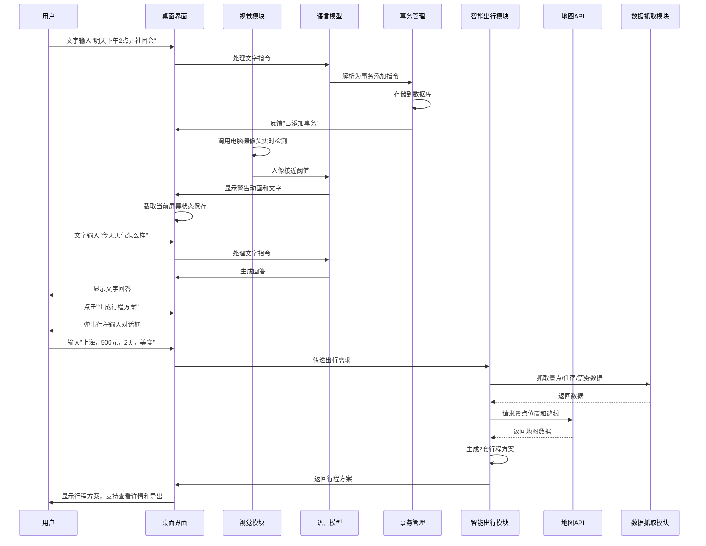

# 桌面电子宠物项目立项计划书（集成智能出行模块）

## 一、项目愿景
> 我想要做一个能帮助用户管理事务、保护隐私并提供情感陪伴的桌面电子宠物软件；同时在用户需要短途出行时，提供“10分钟决策+落地”的周末轻量旅行助手能力，实现事务管理与生活决策的一体化体验。

## 二、目标用户场景

### 2.1 事务缠身的大学生
**时间**：星期三下午3点  
**地点**：宿舍书桌前  
**环境**：桌上笔记本电脑开着多个窗口，手机消息不断弹出  
**情绪**：焦虑、烦躁，感觉“事情太多，脑子不够用”  
**具体痛点**：
- 刚收到社团活动通知，需要记住明天下午2点的会议
- 期中考试复习计划还没安排，担心复习时间不够
- 明天要交的编程作业还没写完，思路卡壳
- 想找手机记录任务，却被微信消息吸引，忘记了原本要做什么
**心里OS**："要是有个东西能直接帮我记下来所有事，还能提醒我就好了！"

### 2.2 临时离开工位的办公人员
**时间**：星期五上午10点半  
**地点**：公司开放办公区  
**环境**：工位上放着笔记本电脑，周围同事在忙碌  
**情绪**：纠结、不安  
**具体痛点**：
- 突然接到快递电话，需要下楼取快递
- 担心离开期间有人翻看自己的电脑或文件
- 不想麻烦同事帮忙看管，觉得不好意思
**心里OS**："要是电脑能自己看家就好了！"

### 2.3 需要短暂放松的电脑办公者
**时间**：星期四下午4点  
**地点**：家中书房  
**环境**：连续工作了3小时，眼睛酸涩，脑子发胀  
**情绪**：疲惫、压抑  
**具体痛点**：
- 想放松一下，但又不想刷手机浪费时间
- 希望有个简单的互动来缓解压力
- 想要一种有成就感的放松方式
**心里OS**："要是有个能陪我聊两句的小玩意儿就好了！"

### 2.4 周末短途出行的大学生
**时间**：周五晚上8点  
**地点**：宿舍  
**环境**：窝在宿舍，打开小红书刷攻略  
**情绪**：决策疲劳，纠结不定  
**具体痛点**：
- 小红书/抖音攻略碎片化、信息滞后
- 携程/飞猪功能繁杂，需手动切换多个页面比价、拼凑行程
- 地图软件仅能导航，无法整合“景点+交通+住宿”的一体化方案
**心里OS**："要是能10分钟内生成一套完整的周末出行方案就好了！"

## 三、创新点

### 3.1 精准的场景化解决方案
- **事务管理**：通过文字输入快速添加任务，结合定点提醒，解决用户“记不住”的核心痛点
- **电脑保护**：利用电脑摄像头识别，在用户离开时自动启动保护模式，解决用户“隐私安全”的担忧
- **情感陪伴**：提供可自定义的文字互动模式，让用户在放松时获得成就感，解决用户“缺乏个性化陪伴”的问题
- **智能出行**：10分钟内生成2套最优周末短途游方案，解决用户“攻略筛选费时间、行程拼凑麻烦、比价繁琐”的痛点

### 3.2 差异化竞争优势
| 对比维度 | 市面现有产品 | 本项目产品 |
|---------|-------------|-----------|
| 功能定位 | 单一功能（如仅提醒或仅陪伴） | 多功能集成，覆盖事务管理、隐私保护、情感陪伴、智能出行多个场景 |
| 定制性 | 有限，无法深度自定义 | 提供开放编程接口，支持用户自定义互动逻辑 |
| 隐私保护 | 无相关功能 | 具备屏幕保护和人像识别功能，守护用户隐私 |
| 情感体验 | 标准化，缺乏个性化 | 用户可参与互动设计，增强成就感 |
| 资源占用 | 较高，需独立运行 | 轻量化设计，作为桌面应用低资源占用运行 |
| 技术架构 | 复杂，依赖多种硬件 | 纯软件实现，依赖轻量级模型，部署简单 |
| 出行决策 | 无相关功能 | 集成智能出行模块，10分钟内生成完整周末出行方案 |

### 3.3 技术与情感的结合
- 不仅提供实用功能，更注重用户情感体验
- 通过开放编程接口，让用户从“使用者”转变为“创造者”
- 结合视觉、文字等多模态交互，提供更自然的用户体验
- 轻量化设计，降低用户使用门槛
- 实现事务管理与生活决策的一体化体验

## 四、产品主要功能

### 4.1 核心功能

| 功能模块 | 功能描述 | 用户价值 |
|---------|---------|---------|
| **事务管理** | 通过文字输入快速添加任务，设置定点提醒 | 帮助用户管理繁杂事务，避免遗忘重要事项 |
| **哈气功能** | 调用电脑摄像头识别人像，接近时显示警告并记录 | 保护用户电脑隐私，防止他人未经允许查看屏幕 |
| **文字互动** | 通过文字输入与桌宠进行聊天互动 | 满足用户在安静环境下的互动需求 |
| **桌面装饰** | 可爱的虚拟形象在桌面自由活动 | 美化桌面，增添趣味性 |
| **智能出行** | 输入出发城市、预算、天数、偏好，10分钟内生成2套最优周末短途游方案，包含景点顺序、交通方式、住宿推荐及实时比价 | 解决用户周末出行决策难题，10分钟内完成“攻略筛选+行程拼凑+比价”全流程 |

### 4.2 创意扩展功能

| 功能模块 | 功能描述 | 用户价值 | 可行性 |
|---------|---------|---------|-------|
| **智能壁纸联动** | 根据用户心情或天气自动更换桌面壁纸 | 提升桌面美观度，增强用户体验 | 高 |
| **应用使用统计** | 统计用户应用使用时间，提供健康使用建议 | 帮助用户合理安排时间，减少沉迷 | 高 |
| **虚拟宠物养成** | 通过完成任务获得经验值，解锁宠物新形象和技能 | 增加用户粘性，让任务管理更有趣 | 高 |
| **专注模式** | 进入专注模式时，宠物会监督用户，屏蔽干扰通知 | 帮助用户保持专注，提高工作效率 | 中 |
| **AI绘画助手** | 可通过文字描述让桌宠生成简单的创意画 | 激发用户创造力，提供娱乐价值 | 中 |
| **代码小助手** | 支持简单的代码问题解答和调试建议 | 帮助程序员快速解决问题，提高效率 | 中 |
| **梦境记录** | 允许用户记录梦境，桌宠会进行简单的解析 | 满足用户好奇心，提供情感支持 | 高 |
| **心情日记** | 支持用户记录每日心情，生成心情变化图表 | 帮助用户了解情绪变化，提供情感关怀 | 高 |

## 五、技术边界与解决方案

### 5.1 技术选型

| 功能模块 | 核心技术/库/框架 | 技术来源 |
|---------|----------------|---------|
| 视觉识别 | YOLOv5模型（轻量版） | 开源计算机视觉模型 |
| 语言理解 | DeepSeek R1模型（API调用/本地部署） | 开源大语言模型 |
| 事务管理 | SQLite数据库 | Python内置库 |
| 桌面渲染 | Pygame/PyQt5 | Python第三方库 |
| 虚拟形象 | 开源2D/3D模型 | 开源社区 |
| 虚拟形象（可选） | Live2D | 商业/开源SDK |
| AI绘画 | Stable Diffusion API | 开源AI绘画API |
| 应用统计 | psutil库 | Python第三方库 |
| 壁纸更换 | ctypes库（Windows）/ os库 | Python内置库 |
| **智能出行** | | |
| 前端交互 | PyQt5对话框 | Python第三方库 |
| 数据抓取 | Beautiful Soup + Requests | Python第三方库 |
| 地图服务 | 高德地图开放平台API | 商业API服务 |
| 数据存储 | JSON轻量存储 | Python内置库 |
| 行程生成算法 | 自定义Python算法 | 自研 |

### 5.2 核心技术流程图

### 5.3 数据流向

1. **事务管理**：
   - 输入：用户文字指令
   - 处理：语言模型解析 → 事务数据库操作
   - 输出：桌面通知反馈，定时提醒

2. **哈气功能**：
   - 输入：电脑摄像头视频流
   - 处理：YOLOv5目标检测 → 人像接近判断 → 触发警告
   - 输出：桌面警告动画，屏幕状态保存

3. **文字互动**：
   - 输入：用户文字提问
   - 处理：语言模型生成回答
   - 输出：文字回答，桌面动画反馈

4. **智能出行**：
   - 输入：用户出行需求（出发城市、预算、天数、偏好）
   - 处理：
     1. Requests抓取景点/票务/住宿公开数据
     2. Beautiful Soup解析筛选（匹配预算和偏好）
     3. 高德地图API获取景点位置和规划路线
     4. 自定义算法生成2套差异化行程方案
   - 输出：包含每日景点顺序、交通方式、住宿推荐、费用估算的行程方案，支持导出Markdown格式

### 5.4 用户反馈收集

- **内置反馈功能**：桌宠定期询问用户使用体验，用户可通过文字回复
- **日志记录**：自动记录功能使用频率和时长
- **开放问卷**：通过桌面弹窗推送问卷链接，邀请用户填写详细反馈
- **行程反馈**：行程结束后弹出极简问卷，收集方案匹配度、价格实用性、操作便捷性等反馈

## 六、最小可行性产品

### 6.1 核心功能实现方案

| 功能模块 | 核心实现技术 | 实现方式 | 预期效果 |
|---------|------------|---------|--------|
| **事务管理** | SQLite数据库 + 语言模型API | 1. 用户通过文字输入任务 2. 语言模型解析任务内容和时间 3. 存储到SQLite数据库 4. 到达提醒时间时弹窗提醒 | 用户可通过文字快速添加任务，系统自动解析并设置提醒，到期弹窗通知 |
| **哈气功能** | YOLOv5轻量版 | 1. 调用电脑摄像头 2. 使用YOLOv5检测人像 3. 当人像接近屏幕时，显示警告动画 4. 截取当前屏幕状态保存 | 当有人靠近电脑时，桌宠会显示警告，防止他人查看屏幕，保护用户隐私 |
| **文字互动** | 语言模型API | 1. 用户输入文字消息 2. 发送到语言模型API 3. 将模型回复显示在桌宠对话框中 | 用户可与桌宠进行文字聊天，获得智能回复，缓解压力，提供情感陪伴 |
| **桌面装饰** | Pygame/PyQt5 + 开源2D模型 | 1. 使用Pygame/PyQt5创建桌面窗口 2. 加载开源2D模型 3. 实现模型的简单动画和移动 | 可爱的2D虚拟形象在桌面自由活动，美化桌面，增添趣味性 |
| **智能出行** | Python + Beautiful Soup + Requests + 高德地图API | 1. 用户通过桌宠右键菜单打开行程生成对话框 2. 输入出发城市、预算、天数、偏好 3. 抓取景点/住宿/票务公开数据 4. 调用高德地图API获取位置和路线 5. 生成2套行程方案 6. 导出Markdown格式行程文件 | 用户可10分钟内获得2套完整的周末短途游方案，包含景点顺序、交通方式、住宿推荐及费用估算 |

### 6.2 技术整合方案

1. **基础架构**：使用Python作为主要开发语言，采用模块化设计，便于后续扩展
2. **模型部署**：
   - 语言模型：初期使用API调用，降低部署难度；后期可考虑本地部署轻量级模型
   - 视觉模型：使用YOLOv5轻量版，直接部署在本地，保证实时性
   - 地图服务：使用高德地图开放平台API，获取景点位置和路线规划
3. **数据存储**：
   - 用户任务和设置：使用SQLite数据库存储
   - 行程数据：使用JSON轻量存储，无需后端服务
4. **界面渲染**：使用Pygame或PyQt5实现桌面界面，支持透明背景和无边框窗口
5. **行程生成**：自定义Python算法，按“景点顺路性+游玩强度”排序生成行程方案

### 6.3 预期效果

- **用户体验**：简洁直观的操作界面，快速响应的功能交互
- **资源占用**：CPU占用率低于20%，内存占用低于200MB
- **部署难度**：一键安装，无需复杂配置
- **功能完整性**：包含事务管理、哈气功能、文字互动、桌面装饰和智能出行五大核心功能
- **可扩展性**：模块化设计，便于后续添加新功能
- **出行决策效率**：10分钟内完成从需求输入到行程生成的全流程

## 七、落地周期与里程碑

### 7.1 关键时间节点（Demo Day：第14天）

| 时间节点 | 完成目标 | 验收标准 |
|---------|---------|---------|
| **第1天** | 项目立项，确定需求和技术方案 | 完成需求文档和技术选型报告 |
| **第2天** | 开发环境配置，基础框架搭建 | 搭建项目基础架构，实现简单桌面窗口 |
| **第3天** | 桌面虚拟形象渲染 | 实现开源2D模型在桌面显示和简单移动 |
| **第4天** | 文字互动功能开发 | 实现文字输入与桌宠聊天功能，调用语言模型API |
| **第5天** | 智能出行模块基础框架搭建 | 完成行程输入对话框和基础数据结构设计 |
| **第6天** | 智能出行数据抓取模块开发 | 实现景点、住宿、票务数据的抓取和解析 |
| **第7天** | 事务管理模块开发 | 能通过文字指令完成事务的增删改查 |
| **第8天** | 智能出行地图接口集成 | 调用高德地图API获取景点位置和路线规划 |
| **第9天** | 视觉识别模块集成 | 调用电脑摄像头，使用YOLOv5实现人像检测 |
| **第10天** | 智能出行行程生成算法开发 | 实现2套差异化行程方案的生成逻辑 |
| **第11天** | 哈气功能实现 | 检测到人像接近时显示警告并记录 |
| **第12天** | 功能整合与优化 | 完成所有核心功能的整合，优化用户体验，确保行程生成时间在10分钟内 |
| **第13天** | 行程导出功能开发 | 实现Markdown格式行程文件的导出 |
| **第14天** | Demo演示准备 | 完成Demo演示，准备演示文档 |

### 7.2 熔断标准

| 风险点 | 熔断条件 | 应对方案 |
|-------|---------|---------|
| 语言模型API调用失败 | 连续5次调用失败 | 改用本地规则引擎处理简单指令，后期优化API调用 |
| YOLOv5模型运行卡顿 | 检测帧率低于5fps | 降低模型复杂度，使用轻量级版本或减少检测频率 |
| 桌面渲染性能问题 | CPU占用率超过30% | 优化渲染逻辑，降低动画复杂度 |
| API调用费用过高 | 单日API费用超过预算 | 限制API调用频率，优化本地缓存机制 |
| 行程生成时间过长 | 生成时间超过15分钟 | 简化行程生成算法，减少数据抓取量，优先使用本地缓存数据 |
| 地图API调用失败 | 连续5次调用失败 | 使用备用地图API，或简化为基于距离估算的路线规划 |

## 八、项目立项开发计划

### 8.1 团队分工

| 角色 | 职责 | 人数 |
|------|------|------|
| 开发者1 | 项目整体架构设计，核心功能开发（事务管理、文字互动、智能出行模块） | 1 |
| 开发者2 | 视觉模块开发，虚拟形象渲染，UI设计，智能出行前端交互 | 1 |

### 8.2 开发流程

1. **需求确认**：明确各功能模块的详细需求和验收标准（第1天）
2. **原型开发**：快速搭建基础框架，验证核心功能可行性（第2-3天）
3. **迭代开发**：采用敏捷开发方式，每2天进行一次迭代（第4-12天）
4. **测试优化**：持续进行功能测试和性能优化，确保行程生成时间在10分钟内（第13天）
5. **Demo准备**：准备Demo演示和文档（第14天）

### 8.3 资源需求

| 资源类型 | 具体需求 | 来源 |
|---------|---------|------|
| 开发语言 | Python 3.8+ | 开源 |
| 开发工具 | PyCharm, Git | 开源/免费 |
| 第三方库 | Pygame, PyQt5, YOLOv5, psutil, Beautiful Soup, Requests等 | 开源 |
| API服务 | 语言模型API, 高德地图开放平台API | 免费/付费（初期使用免费额度） |
| 虚拟形象资源 | 开源2D/3D模型 | 开源社区 |
| 行程数据 | 初始城市景点/住宿/票务数据 | 手动收集+网络抓取 |

## 九、预期成果

### 9.1 Demo Day 演示内容

1. **事务管理功能**：通过文字输入添加任务，设置提醒
2. **哈气功能**：演示电脑摄像头识别人像并触发警告
3. **文字互动**：通过文字与桌宠聊天
4. **桌面装饰**：展示虚拟形象在桌面活动
5. **智能出行功能**：
   - 输入出行需求（如"上海，500元，2天，美食"）
   - 演示数据抓取和行程生成过程
   - 展示2套生成的行程方案
   - 演示行程详情查看和Markdown导出功能

### 9.2 长期规划

- **V1.0**：完成核心功能开发，实现基础交互
- **V2.0**：优化用户体验，增加1-2个创意扩展功能，扩展更多城市的出行数据
- **V3.0**：支持多平台（Windows, macOS, Linux），增加实时比价功能
- **V4.0**：建立开源社区，吸引更多开发者参与，支持用户自定义行程模板

## 十、项目可行性分析

### 10.1 技术可行性
- 所选技术均为成熟的开源技术，有丰富的文档和社区支持
- 无需硬件设备，仅需普通电脑即可运行
- 各功能模块之间的集成难度适中
- 可利用现有API服务，无需自行训练复杂模型
- 视觉模型采用轻量级版本，保证实时性和低资源占用
- 行程生成算法逻辑清晰，易于实现

### 10.2 成本可行性
- 开发工具和第三方库均为开源免费
- 初期可使用API服务的免费额度，后期根据需求付费
- 无需硬件采购成本，降低项目启动门槛
- 2人团队，开发人力成本低

### 10.3 市场可行性
- 目标用户群体（大学生、办公人员）数量庞大
- 现有桌面宠物软件功能单一，缺乏创新性
- 现有旅游规划工具功能繁杂，决策效率低
- 产品具备实用功能和情感属性，容易形成用户粘性
- 轻量化设计，适合各种配置的电脑使用
- 纯软件实现，用户无需额外购买硬件，降低使用门槛
- 智能出行功能解决了用户周末出行决策的核心痛点

## 十一、结论

本项目针对用户在事务管理、隐私保护、情感陪伴和智能出行方面的痛点，提出了一个纯软件实现的桌面电子宠物解决方案，集成了智能出行模块作为核心功能之一。通过合理的技术选型和明确的开发计划，能够在两周内完成核心功能的开发和演示。项目采用轻量化设计，依赖语言类大模型、轻量级视觉模型和地图API，实现了事务管理、哈气功能、文字互动、桌面装饰和智能出行五大核心功能。2人团队即可完成开发，开发成本低，市场潜力大，值得进一步推进。

---

**项目负责人**：XXX  
**联系邮箱**：XXX@example.com  
**立项日期**：2026年1月22日