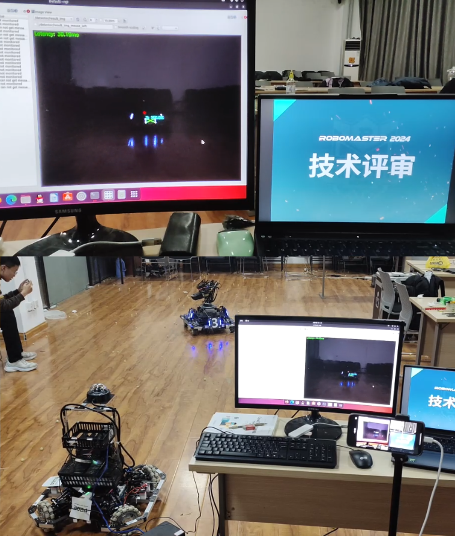

# 齐浩龙项目作品集

> 面向求职投递的 GitHub 项目展示仓库。  
> 重点展示我在 RoboMaster 机器人视觉、Python 计算机视觉、Java 后端、Python 桌面应用、C++/Qt 和软件测试方向的实践经历。

## 个人定位

我是齐浩龙，山东理工大学计算机科学与技术专业本科生，2026 届应届生。项目经历主要集中在机器人视觉系统部署与调试、视觉算法原型开发、后端业务系统开发、桌面应用工程化和软件测试实践。

- **求职方向**：软件开发工程师 / 后端开发工程师 / C++ 或 Python 视觉算法工程相关岗位
- **核心技能**：C++、Python、Java、ROS2、OpenCV、PyTorch、Spring Boot、MyBatis-Plus、MySQL、Qt、JUnit
- **项目特点**：既有 RoboMaster 实车部署、相机接入和调试文档沉淀，也有可运行的视觉算法 demo、后端业务系统、桌面应用和测试工程
- **简历附件**：[个人简历v6.pdf](./个人简历v6.pdf)
- **联系方式**：`qhaooolg@foxmail.com` / 微信 `QHaoooLG`

## 快速阅读建议

如果您来自招聘场景，可以按目标岗位方向快速浏览：

| 目标方向 | 推荐阅读 | 关注重点 |
|---|---|---|
| 机器人视觉 / C++ / ROS2 | [RM-QIQI-vision-main](./RM-QIQI-vision-main) | ROS2 工作空间部署、Hikvision 工业相机接入、Foxglove 调试、实车联调和团队技术文档 |
| 视觉算法 / Python / PyTorch | [rm_energy_segmentation](./rm_energy_segmentation) | RoboMaster 能量机关实例分割、伪 mask、Tiny U-Net、模块参数估计和自动化测试 |
| Java 后端开发 | [TicketingSystem](./TicketingSystem) | Spring Boot + MyBatis-Plus 分层结构、票务业务建模、Controller/Service/Mapper 实现 |
| Python 桌面应用 | [CubiclePal_MVP_v0](./CubiclePal_MVP_v0) | PyQt5 桌面助手、任务管理、OpenCV 隐私检测、SQLite 数据管理 |
| C++/Qt 基础工程 | [Zork-Qt-RPG](./Zork-Qt-RPG) | Qt Widgets、OOP 建模、游戏状态管理、道具与战斗系统 |
| 软件测试 / 质量保障 | [SoftwareTest](./SoftwareTest) | JUnit 单元测试、边界值分析、等价类划分、排序/搜索/日期逻辑测试 |

## 项目一览

| 项目 | 方向 | 技术栈 | 我主要做了什么 | 推荐查看 |
|---|---|---|---|---|
| [RM-QIQI-vision-main](./RM-QIQI-vision-main) | RoboMaster 机器人视觉部署 | C++、ROS2、OpenCV、Foxglove、Hikvision SDK | 负责视觉自瞄系统部署、相机接入验证、参数调试、实车联调和技术传承文档整理 | [README](./RM-QIQI-vision-main/README.md)、[视觉避坑手册](./RM-QIQI-vision-main/QIQI视觉避坑手册.pdf)、[演示视频](./RM-QIQI-vision-main/开源机器人自瞄项目部署效果实录.mp4) |
| [rm_energy_segmentation](./rm_energy_segmentation) | RoboMaster 能量机关实例分割 | Python、PyTorch、OpenCV、Tiny U-Net、Gauss-Newton | 将能量机关视频识别整理为开源结构，实现抽帧、伪标签、训练、推理、语义后处理和模块参数估计闭环 | [README](./rm_energy_segmentation/README.md)、[系统设计](./rm_energy_segmentation/docs/system_design.md)、[测试入口](./rm_energy_segmentation/scripts/run_tests.py) |
| [TicketingSystem](./TicketingSystem) | Java 后端 / 景区票务管理 | Java、Spring Boot、MyBatis-Plus、MySQL、Maven | 构建景区票务管理系统，覆盖用户、景点、票种、预约、订单、支付等业务模块 | [README](./TicketingSystem/README.md)、[主模块源码](./TicketingSystem/TicketingSystem_main/src/main/java/com/sdut) |
| [CubiclePal_MVP_v0](./CubiclePal_MVP_v0) | Python 桌面智能助手 | Python、PyQt5、OpenCV、SQLite、PyYAML | 设计 MVP 架构，实现桌面宠物、任务管理、隐私保护、出行规划、对话窗口和测试脚本 | [README](./CubiclePal_MVP_v0/README.md)、[项目文档](./CubiclePal_MVP_v0/doc/README.md) |
| [Zork-Qt-RPG](./Zork-Qt-RPG) | C++/Qt 游戏开发 | C++17、Qt Widgets、qmake | 实现房间地图、角色状态、道具系统、怪物战斗、随机传送和 Qt 弹窗交互 | [README](./Zork-Qt-RPG/README.md)、[源码](./Zork-Qt-RPG/sourceFile) |
| [SoftwareTest](./SoftwareTest) | 软件测试 / 自动化测试 | Java、JUnit、Maven | 针对排序、搜索、日期计算、立方体体积等逻辑编写单元测试、边界值和等价类测试 | [README](./SoftwareTest/README.md)、[A1 测试代码](./SoftwareTest/SoftwareTest_1/softwareTest_A1code/src/test/java)、[A2 测试代码](./SoftwareTest/SoftwareTest_2/softwareTest_A2code/src/test/java) |

## 能力映射

| 能力方向 | 可验证材料 | 说明 |
|---|---|---|
| ROS2 机器人视觉部署 | [RM-QIQI-vision-main/src](./RM-QIQI-vision-main/src) | 包含 `rm_vision`、Hikvision 相机节点、Foxglove bridge、bringup 配置等部署与调试材料 |
| 视觉算法原型开发 | [rm_energy_segmentation/rmvs](./rm_energy_segmentation/rmvs) | 包含数据集扫描、伪 mask 生成、Tiny U-Net、推理后处理、圆拟合和可视化模块 |
| 后端业务系统开发 | [TicketingSystem/TicketingSystem_main](./TicketingSystem/TicketingSystem_main) | 包含 Controller、Service、Mapper、POJO、DTO、配置和前端静态资源 |
| 桌面应用工程化 | [CubiclePal_MVP_v0/src](./CubiclePal_MVP_v0/src) | 包含 `ai`、`core`、`ui`、`utils` 分层，以及配置、数据和测试脚本 |
| C++/Qt 面向对象设计 | [Zork-Qt-RPG/sourceFile](./Zork-Qt-RPG/sourceFile) | 包含角色、房间、怪物、道具、战斗判定和 Qt 界面交互 |
| 软件测试设计 | [SoftwareTest](./SoftwareTest) | 包含 JUnit 测试、边界值分析、等价类测试和课程测试报告 |

## 重点项目

### 1. RM-QIQI-vision-main：RoboMaster 机器人视觉自瞄系统部署

该项目主要展示我在 RoboMaster 机器人视觉方向的工程部署能力。项目围绕 ROS2 视觉自瞄系统展开，重点不是从零重写所有算法模块，而是在开源视觉生态基础上完成环境部署、相机接入、参数调试、链路验证、实车联调和团队文档沉淀。

**我的职责**

- 担任 RoboMaster 齐奇战队算法组组长，推进视觉自瞄方向研发、调试和成员培养。
- 基于 `rm_vision`、`rm_auto_aim` 等模块完成 ROS2 工作空间配置、依赖安装和启动链路整理。
- 接入 Hikvision 工业相机，验证相机参数、图像话题、启动配置和实车运行状态。
- 使用 Foxglove Studio 查看图像、目标、TF 和运行状态，结合实车表现修正参数。
- 将部署问题、依赖安装、常见错误、相机配置和调试流程整理为 [QIQI 视觉避坑手册](./RM-QIQI-vision-main/QIQI视觉避坑手册.pdf)，用于战队后续技术传承。

**可验证内容**

- 自瞄系统演示：[开源机器人自瞄项目部署效果实录.mp4](./RM-QIQI-vision-main/开源机器人自瞄项目部署效果实录.mp4)
- 自瞄算法模块：[rm_auto_aim-main](./RM-QIQI-vision-main/src/rm_auto_aim-main)
- 启动配置与参数：[rm_vision_bringup](./RM-QIQI-vision-main/src/rm_vision-main/rm_vision_bringup)
- 海康相机模块：[ros2_hik_camera-main](./RM-QIQI-vision-main/src/ros2_hik_camera-main)
- 串口通信模块：[rm_serial_driver-main](./RM-QIQI-vision-main/src/rm_serial_driver-main)

> 说明：本项目包含对 RoboMaster 开源视觉生态的学习、集成、部署、调试与文档沉淀。原开源项目请参考 [rm_vision](https://github.com/chenjunnn/rm_vision)，本仓库强调我的部署落地、实车调试和团队贡献。

### 2. rm_energy_segmentation：RoboMaster 能量机关实例分割与模块参数估计

该项目是本仓库中新整理的开源展示项目，面向 RoboMaster 能量机关识别场景。项目使用 Tiny U-Net 完成亮区分割，通过连通域分析和语义后处理拆分装甲模块、中心 R 标和整体机关区域，并估计模块中心、旋转半径、模块角度、角速度和拟合误差。

**项目亮点**

- 从视频抽帧、伪标签生成、模型训练、视频/帧目录推理到可视化输出，形成完整实验闭环。
- 在缺少人工实例 mask 的情况下，通过红、橙、黄高亮区域生成弱监督伪 mask。
- 使用暖色门控、连通域过滤、角向拆分和语义角色分配，减少过曝、反光和支架粘连干扰。
- 使用 Gauss-Newton 圆拟合估计机关中心、半径、角度、角速度和拟合误差。
- 输出 `annotated.mp4`、逐帧 `frame_results.jsonl` 和 `summary.json`，便于调参与复盘。
- 测试使用合成数据，`python scripts/run_tests.py` 可在无外部视频的情况下验证核心流程。

**可验证内容**

- 项目说明：[rm_energy_segmentation/README.md](./rm_energy_segmentation/README.md)
- 核心代码：[rmvs](./rm_energy_segmentation/rmvs)
- 系统设计：[docs/system_design.md](./rm_energy_segmentation/docs/system_design.md)
- 训练入口：[scripts/train_model.py](./rm_energy_segmentation/scripts/train_model.py)
- 识别入口：[scripts/run_video_recognition.py](./rm_energy_segmentation/scripts/run_video_recognition.py)
- 自动化测试：[test](./rm_energy_segmentation/test)

### 3. TicketingSystem：景区票务管理系统

TicketingSystem 是一个 Java/Maven 多模块项目，围绕景区票务业务进行建模，包含用户、景点、票种、人员、预约关系、订单、支付等模块。项目适合展示后端分层开发、数据访问、配置管理和基础业务闭环实现能力。

**技术与结构**

- `TicketingSystem_main`：Spring Boot Web 主模块，包含 Controller、Service、Mapper、POJO、DTO、配置和前端静态资源。
- `PeriodicTask`：独立定时任务模块。
- 数据访问：MyBatis-Plus + Mapper XML。
- 工程管理：Maven 多模块、MySQL 驱动、Druid 数据源、POI 文件处理。

**可验证内容**

- Maven 多模块配置：[pom.xml](./TicketingSystem/pom.xml)
- 主模块依赖：[TicketingSystem_main/pom.xml](./TicketingSystem/TicketingSystem_main/pom.xml)
- Controller 层：[controller](./TicketingSystem/TicketingSystem_main/src/main/java/com/sdut/controller)
- Service 层：[service](./TicketingSystem/TicketingSystem_main/src/main/java/com/sdut/service)
- Mapper 层：[mapper](./TicketingSystem/TicketingSystem_main/src/main/java/com/sdut/mapper)
- 配置文件：[application.yml](./TicketingSystem/TicketingSystem_main/src/main/resources/application.yml)

### 4. CubiclePal_MVP_v0：桌面智能助手 MVP

CubiclePal 是一个 Python 桌面智能助手项目，目标是把桌面宠物、任务管理、隐私保护和出行规划组合成一个可运行的办公辅助工具。

**核心功能**

- 桌面宠物窗口和系统托盘：基于 PyQt5 实现宠物显示、拖拽、右键菜单和对话框入口。
- 任务管理：通过自然语言解析任务，写入 SQLite，并提供提醒服务与任务状态管理。
- 隐私保护：基于 OpenCV Haar 人脸检测判断用户是否离座，并触发锁屏保护。
- 出行规划：解析目的地、预算、天数和偏好，生成行程方案，并支持导出 Markdown。
- 工程化结构：`src/ai`、`src/core`、`src/ui`、`src/utils` 分层清晰，配套测试和演示脚本。

**可验证内容**

- 主入口：[main.py](./CubiclePal_MVP_v0/main.py)
- UI 层：[src/ui](./CubiclePal_MVP_v0/src/ui)
- 业务逻辑：[src/core](./CubiclePal_MVP_v0/src/core)
- 数据与配置：[database.py](./CubiclePal_MVP_v0/src/utils/database.py)、[config.yaml](./CubiclePal_MVP_v0/resource/config.yaml)
- 测试与演示：[test](./CubiclePal_MVP_v0/test)

### 5. Zork-Qt-RPG：基于 Qt 的 Roguelike RPG 游戏

Zork-Qt-RPG 是一个 C++/Qt 项目，适合展示面向对象设计、GUI 事件处理和游戏状态管理能力。

**核心实现**

- 房间与地图：`Room` 维护相邻房间、道具、怪物和房间描述。
- 角色状态：`Character` 维护生命、耐力、武器值、分数和道具效果。
- 道具系统：`Food`、`Weapon`、`Scholarism` 继承或复用 `Item`，实现不同属性加成。
- 战斗逻辑：`Judge` 处理战斗、逃跑、耐力消耗和胜负判断。
- Qt 界面：`MainWindow`、`monsterRoomDialog`、`gameoverDialog` 实现图形化交互。

**可验证内容**

- Qt 工程文件：[Lab56.pro](./Zork-Qt-RPG/Lab56.pro)
- 游戏逻辑入口：[ZorkUL.cpp](./Zork-Qt-RPG/sourceFile/ZorkUL.cpp)
- 战斗判定：[Judge.cpp](./Zork-Qt-RPG/sourceFile/Judge.cpp)
- UI 交互：[mainwindow.cpp](./Zork-Qt-RPG/sourceFile/mainwindow.cpp)

### 6. SoftwareTest：软件测试工程实践

SoftwareTest 用于展示基础测试方法和 JUnit 自动化测试实践，分为两个阶段：

- `SoftwareTest_1`：对排序、搜索、数学函数等基础算法进行单元测试，覆盖正常输入、边界输入和异常输入。
- `SoftwareTest_2`：围绕 `NextDay` 和 `CubeVolume` 设计边界值分析、等价类划分和参数化测试。

**可验证内容**

- A1 源码：[src/main/java](./SoftwareTest/SoftwareTest_1/softwareTest_A1code/src/main/java)
- A1 测试：[src/test/java](./SoftwareTest/SoftwareTest_1/softwareTest_A1code/src/test/java)
- A2 源码：[src/main/java](./SoftwareTest/SoftwareTest_2/softwareTest_A2code/src/main/java/qhaooolg/softwareTest_A2code)
- A2 测试：[src/test/java](./SoftwareTest/SoftwareTest_2/softwareTest_A2code/src/test/java/qhaooolg/softwareTest_A2code)
- 测试报告文档：[A1 报告](./SoftwareTest/SoftwareTest_1/softwareTest_A1_report.doc)、[A2 报告](./SoftwareTest/SoftwareTest_2/Report_Assignment%202%20Part%202%202024.doc)

## 荣誉与经历摘要

- RoboMaster 齐奇战队算法组组长，负责视觉/算法方向研发推进、实车调试与成员培养。
- 第 23 届全国大学生机器人大赛 RoboMaster 超级对抗赛全国赛三等奖，工程机器人组/雷达组相关角色。
- 2024 中国工程机器人大赛暨国际公开赛双足竞步赛目一等奖。
- “建行杯”山东省大学生创新大赛省级金奖，智乒先锋项目核心成员。
- 山东省大学生智能技术应用设计大赛多项奖项，承担双足竞步/竞速、舞蹈机器人方向技术负责人角色。
- 学术成果：`UNDERWATER IMAGE ENHANCEMENT TECHNIQUE BASED ON CYCLEGAN AND FREQUENCY DECOMPOSITION CORRECTION MODEL` 论文二作。

## 仓库说明

- 本仓库主要用于求职投递时集中展示项目经历，不是单一产品仓库。
- 部分项目来自课程设计、竞赛部署或开源项目集成实践，因此每个子目录保留了不同阶段的代码、报告、文档和演示材料。
- 部分大型视频、模型权重或数据集不适合直接纳入 Git 历史，仓库优先保留代码、README、截图、轻量文档和可复现实验入口。
- 对招聘方而言，建议重点关注：我的职责是否清晰、代码结构是否可读、项目文档是否能说明问题、以及经历是否与目标岗位匹配。

