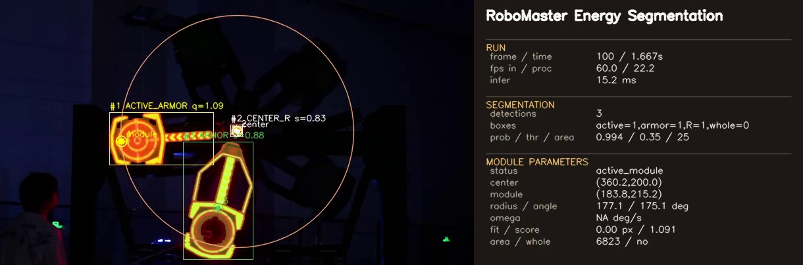
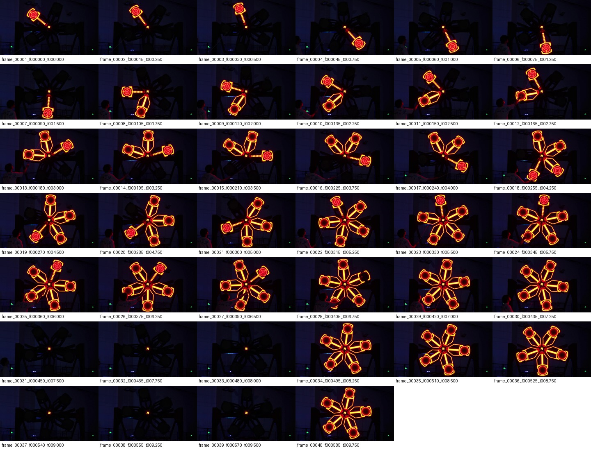

# RM Energy Segmentation

> RoboMaster 能量机关视频实例分割与模块参数估计系统。

`RM Energy Segmentation` 是一个面向 RoboMaster 能量机关视觉识别场景的轻量级 Python 项目。项目使用 Tiny U-Net 完成能量机关亮区分割，通过连通域分析与语义后处理拆分装甲模块、中心 R 标和整体机关区域，并进一步估计模块中心、旋转半径、模块角度、角速度和拟合误差。



## 项目亮点

- **完整识别闭环**：支持从视频抽帧、伪标签生成、模型训练、视频/帧目录推理到可视化输出。
- **弱监督训练**：在没有人工实例 mask 标注的情况下，基于红、橙、黄高亮区域自动生成伪 mask。
- **实例级后处理**：通过暖色门控、连通域过滤、角向拆分和语义角色分配，减少过曝、反光和支架粘连带来的干扰。
- **能量机关参数估计**：使用 Gauss-Newton 圆拟合估计机关中心、旋转半径、模块角度、角速度和拟合误差。
- **工程化输出**：保存 `annotated.mp4`、逐帧 `frame_results.jsonl` 和 `summary.json`，便于复盘、调参与实验对比。
- **轻量可测**：测试用例使用合成数据，不依赖本地 RoboMaster 视频即可跑通核心训练和推理流程。

## 效果预览

数据集抽帧预览：



> 说明：完整视频、训练数据集、模型权重和推理输出没有直接提交到仓库。这些文件通常体积较大，建议按本文档在本地生成，或通过 GitHub Release、网盘等方式单独发布。

## 项目结构

```text
rm_energy_segmentation/
├── README.md
├── LICENSE
├── requirements.txt
├── pyproject.toml
├── data/
│   └── README.md              # 本地数据目录，Git 默认忽略
├── outputs/
│   └── README.md              # 模型和识别输出目录，Git 默认忽略
├── docs/
│   ├── assets/                # README 使用的轻量展示图片
│   ├── system_design.md       # 系统设计说明
│   └── development_plan.md    # 开发方案说明
├── rmvs/
│   ├── app.py                 # 识别流程编排
│   ├── dataset.py             # 数据集扫描与 PyTorch Dataset
│   ├── infer.py               # 单帧推理与实例提取
│   ├── model.py               # Tiny U-Net 模型
│   ├── paths.py               # 默认项目路径
│   ├── pseudo_label.py        # 弱监督伪 mask 生成
│   ├── tracker.py             # 圆拟合与模块参数估计
│   ├── train.py               # 模型训练循环
│   ├── video_io.py            # 视频和帧目录读取
│   └── visualize.py           # OpenCV 可视化
├── scripts/
│   ├── train_model.py
│   ├── run_video_recognition.py
│   ├── run_gui.py
│   └── run_tests.py
├── test/
│   ├── test_pipeline.py
│   ├── test_module_parameters.py
│   ├── test_pseudo_label.py
│   └── test_visualize.py
└── tools/
    └── extract_video_frames.py
```

## 环境准备

推荐环境：

- Python 3.10+
- Windows / Linux / macOS
- CPU 环境可以完成 smoke test；如果本机已安装支持 GPU 的 PyTorch，也可以使用 CUDA 加速训练和推理。

安装依赖：

```powershell
python -m venv .venv
.\.venv\Scripts\Activate.ps1
python -m pip install --upgrade pip
python -m pip install -r requirements.txt
```

以 editable 模式安装当前项目：

```powershell
python -m pip install -e .
```

## 快速验证

在没有外部 RoboMaster 数据的情况下运行测试：

```powershell
python scripts/run_tests.py
```

`test_pipeline.py` 会创建临时合成数据集，训练一个极小模型 1 个 epoch，并在生成的帧目录上运行识别流程。

也可以对 Python 文件进行语法编译检查：

```powershell
python -m py_compile (Get-ChildItem -Path rmvs,scripts,test,tools -Recurse -Filter *.py | ForEach-Object { $_.FullName })
```

## 数据准备

将本地 RoboMaster 能量机关视频放入 `data/` 目录。

示例：

```text
data/
└── energy_demo.mp4
```

抽取训练帧：

```powershell
python tools/extract_video_frames.py --video data/energy_demo.mp4 --output-dir data/energy_demo_frame_dataset --frame-step 15 --overwrite
```

生成的数据集结构：

```text
data/energy_demo_frame_dataset/
├── images/
├── manifest.json
├── manifest.csv
└── preview_contact_sheet.jpg
```

项目脚本也兼容原始本地工程中的默认命名：

```text
data/关灯红方小能量机关激活全过程.mp4
data/关灯红方小能量机关激活全过程_frame_dataset/
```

## 模型训练

使用自定义抽帧数据集进行训练：

```powershell
python scripts/train_model.py --dataset-dir data/energy_demo_frame_dataset --output-dir outputs/train_filtered --epochs 10 --batch-size 2 --image-size 128 --base-channels 10 --val-ratio 0.2 --progress-interval 5
```

默认输出结构：

```text
outputs/train_filtered/
├── best_model.pt
├── last_model.pt
├── metrics.json
├── training_config.json
└── dataset_manifest.json
```

小规模 demo 数据集推荐参数：

| 参数 | 推荐值 | 说明 |
|---|---:|---|
| `--epochs` | `6` 到 `10` | 小规模弱标签数据容易过拟合 |
| `--batch-size` | `2` | 兼容 CPU 和低显存环境 |
| `--image-size` | `128` 或 `160` | `128` 更快，`160` 细节更多 |
| `--base-channels` | `8` 到 `12` | Tiny U-Net 的通道宽度 |
| `--val-ratio` | `0.2` | 验证集比例 |

## 视频识别

对帧目录运行识别：

```powershell
python scripts/run_video_recognition.py --model outputs/train_filtered/best_model.pt --input data/energy_demo_frame_dataset --output-dir outputs/frame_dir_demo --threshold 0.35 --min-area 35 --max-area-ratio 0.65 --max-instances 6 --max-display-instances 6 --no-window
```

对 MP4 视频运行识别：

```powershell
python scripts/run_video_recognition.py --model outputs/train_filtered/best_model.pt --input data/energy_demo.mp4 --output-dir outputs/video_demo --threshold 0.35 --min-area 25 --max-area-ratio 0.65 --resize-width 720 --max-instances 6 --max-display-instances 6 --no-window
```

打开 OpenCV 可视化窗口：

```powershell
python scripts/run_gui.py --model outputs/train_filtered/best_model.pt --input data/energy_demo.mp4 --threshold 0.35 --min-area 25 --resize-width 720
```

按 `q` 或 `Esc` 退出窗口。

如果只做算法性能测试，不希望保存标注视频，可以关闭视频编码：

```powershell
python scripts/run_video_recognition.py --model outputs/train_filtered/best_model.pt --input data/energy_demo.mp4 --output-dir outputs/video_fast --threshold 0.35 --min-area 25 --resize-width 640 --max-instances 5 --max-display-instances 5 --no-window --no-save-video
```

## 输出格式

一次识别任务会生成如下输出目录：

```text
outputs/video_demo/
├── annotated.mp4
├── frame_results.jsonl
└── summary.json
```

逐帧 JSON 字段示例：

```json
{
  "frame_index": 100,
  "time_sec": 1.667,
  "inference_time_ms": 15.2,
  "detections": [
    {
      "instance_id": 1,
      "role": "active_armor",
      "role_name": "主亮装甲模块",
      "module_point_xy": [183.8, 215.2],
      "module_score": 1.09,
      "score": 0.94,
      "bbox_xyxy": [0.0, 154.0, 326.0, 252.0],
      "mask_area": 6823,
      "center_xy": [177.1, 198.6]
    }
  ],
  "tracking": {
    "mechanism_center": [360.2, 200.0],
    "active_module_center": [183.8, 215.2],
    "fitted_radius": 177.1,
    "module_angle_deg": 175.1,
    "angular_velocity_deg_s": null,
    "fit_error_px": 0.0,
    "module_count": 1,
    "whole_detected": false,
    "module_status": "active_module"
  }
}
```

语义角色说明：

| 角色字段 | 含义 |
|---|---|
| `active_armor` | 当前主亮装甲模块 |
| `armor_module` | 其他检测到的装甲模块 |
| `center_r` | 能量机关中心 R 标 |
| `whole_mechanism` | 整体激活状态下的能量机关框 |
| `light_candidate` | 低优先级灯光候选区域 |

## 算法说明

### 伪 mask 生成

弱标签流程首先在 HSV 空间中保留红、橙、黄高亮区域，合并相邻亮核，再通过形态学去噪和 connected component 过滤生成训练用伪 mask。

### Tiny U-Net 分割

分割模型采用轻量级二分类 Tiny U-Net。训练损失由 BCE with logits 和 Dice loss 组成：

```text
Loss = BCEWithLogitsLoss(logits, mask) + 0.45 * DiceLoss(sigmoid(logits), mask)
```

### 实例与语义角色后处理

推理阶段会将概率图转换为连通域实例，并依次执行：

- 暖色门控；
- 面积与长宽比过滤；
- 粘连连通域角向拆分；
- 中心 R 标筛选；
- 主亮装甲模块评分；
- 整体能量机关框合成。

### 模块参数估计

对于模块参考点：

```text
p_i = (x_i, y_i)
```

`tracker` 会拟合圆模型：

```text
r_i = ||p_i - c||_2 - R
minimize sum_i r_i^2
```

实现中使用小规模 Gauss-Newton solver，输出机关中心、旋转半径、模块角度、角速度和拟合误差。

## 本地演示结果

在原始本地 RoboMaster demo 视频和抽帧数据集上的测试结果如下：

| 场景 | 帧数 | 平均 FPS | 说明 |
|---|---:|---:|---|
| 帧目录识别 | 40 | 16.64 | `threshold=0.35`，`min_area=35` |
| MP4 片段识别 | 120 | 26.38 | `resize_width=720` |
| 完整 MP4 纯算法模式 | 586 | 24.26 | `--no-window --no-save-video` |
| 多模块激活片段验证 | 430 | 22.79 | 多模块点亮阶段 |

以上指标与硬件、数据质量和参数设置有关，仅作为本地 demo 参考。

## 项目文档

- [系统设计说明](docs/system_design.md)
- [开发方案说明](docs/development_plan.md)
- [工具说明](tools/README.md)
- [数据目录说明](data/README.md)
- [输出目录说明](outputs/README.md)

## 后续计划

- 增加小规模公开样例数据集或数据下载脚本。
- 增加可选的 YOLO-seg / Mask R-CNN 对比适配器。
- 增加相机标定与 3D pose estimation。
- 将推理结果导出为面向比赛系统的 ROS2 topic 格式。
- 增加 GitHub Actions，用于 lint 和 tests。

## 许可证

本项目采用 MIT License，详见 [LICENSE](LICENSE)。

